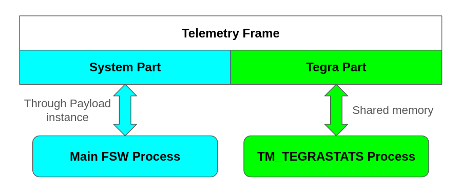
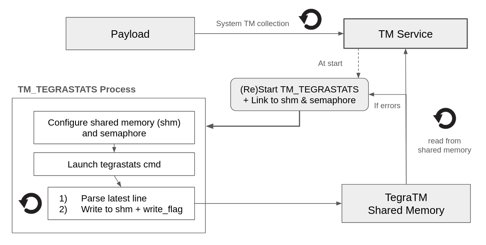

# Telemetry 

The Telemetry Service is responsible for collecting, processing, and managing telemetry data from the system. It also interfaces with NVIDIA Tegra-based hardware to provide real-time statistics and diagnostics for performance monitoring. The Telemetry Service is automatically launched by the Payload instance.

## Architecture 

The Telemetry Frame is composed of two distincts parts, coming from 2 different sources:
- System part: contains general state and information about the submodules running on the flight software main process (time, camera states, last executed command, last error, disk usage, etc).
- Tegra part: provides real-time hardware telemetry data extracted from the NVIDIA tegrastats process (e.g. CPU and GPU usage, memory consumption metrics, temperatures, etc).



The NVIDIA tegrastats utility provides hardware statistics in real time, outputting a structured log to stdout, such as:
```bash
11-27-2024 19:20:22 RAM 3150/7620MB (lfb 37x4MB) SWAP 0/3810MB (cached 0MB) CPU [0%@883,0%@883,0%@883,0%@883,off,off] GR3D_FREQ 0% cpu@63.687C soc2@62.781C soc0@61.5C gpu@62.281C tj@63.687C soc1@62.312C VDD_IN 4233mW/4233mW VDD_CPU_GPU_CV 478mW/478mW VDD_SOC 1317mW/1317mW
```

## Telemetry Processing & IPC Mechanism

### TM_TEGRASTATS Process (Background Processor)

In order to capture the required fields, a background process (TM_TEGRASTATS) continuously fetch the telemetry line via a pipe and parse its raw contents. The extracted relevant metrics are written to a shared memory (fast inter-process communication) for the main process to consume. To ensure synchronization, a write flag is used to indicate when new data is available, and access to shared memory is managed using semaphores to prevent race conditions.

### TM Service (Main Process)

The TM Service (on the main process) links to the shared memory and semaphore and continuously fetches its content, checking the write flag to determine if new data has been written. 
If TM_TEGRASTATS fails to update the shared memory for a predefined timeout period or the main process detects that TM_TEGRASTATS is not running, the TM Service attempts to restart the TM_TEGRASTATS process. In parallel, the system-level telemetry is collected separately through the Payload instance. A summary of the architecture is found below: 



## Non-Jetson platform 

TM_TEGRASTATS automatically detects whether it is running on an NVIDIA Jetson platform. If not, it switches to emulation mode, cycling through a pre-collected dataset of Jetson telemetry samples. This allows testing and integration on non-Jetson platforms without requiring actual hardware, making it useful for development, debugging, and CI testing.

The emulation mode can also be explicitly enabled by passing the emulate argument if one were to launch the TM_TEGRASTATS manually:

```bash
./bin/TM_TEGRASTASTS emulate
```
In this mode, TM_TEGRASTATS continuously cycles through the dataset, simulating real-time telemetry updates as if reading from tegrastats.